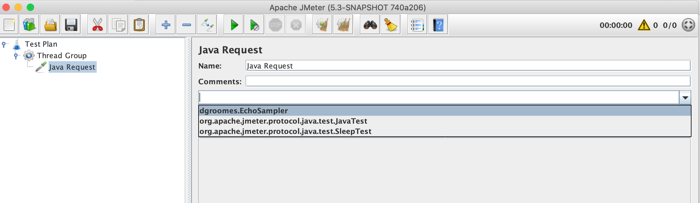

# custom-sampler

This beginner-friendly subproject creates a custom JMeter "Sampler" to exercise some custom Java code.

---
**Beginner Friendly**

This subproject is friendly to Java developers who are new to JMeter. However, this project is somewhat contrived
because it does not require additional Java library dependencies. A real-world Java project would likely require additional
library dependencies. Venture over to the `with-dependencies/` subproject for a more sophisticated JMeter project that
shows how to incorporate additional library dependencies and some other more advanced features.

---

## Description

This project creates a custom JMeter "Sampler" to exercise some custom Java code. Why is this useful? JMeter is a
featureful load testing tool and is equipped with out-of-the-box controls to load test HTTP servers and databases via
JDBC connections. But it doesn't have to stop there! With a custom sampler, you can instrument JMeter to load test any
arbitrary thing that you can invoke using Java code. Want to load test a sorting algorithm you wrote in Java? You can do
that!

## Instructions

Follow these instructions to build our example project and make its `.jar` file available to `jmeter`:

1. Use Java 17
2. Install JMeter
   * Download it at the [offical site](https://jmeter.apache.org/download_jmeter.cgi) or use [SDKMAN!](https://sdkman.io/).
3. Build the project into a `.jar` file:
   * ```shell
     ./gradlew jar
     ```
4. Move the `.jar` into your JMeter installation's `lib/ext/` directory
   * For example, on my computer (it will be a different path on your computer!):
     ```shell
     cp build/libs/custom-sampler.jar ~/.sdkman/candidates/jmeter/5.6/lib/ext
     ```
5. Open the JMeter GUI:
   * ```shell
     jmeter
     ```
6. Next, follow these instructions to create a simple JMeter "Test Plan"
   1. Right-click "Test Plan" in the left-hand menu
   2. On the menu that appears, navigate through and select "Add" > "Threads (Users)" > "Thread Group"
   3. Right-click the "Thread Group" element that appears in the tree on the left
   4. On the menu that appears, navigate through and select "Add" > "Sampler" > "Java Request"
   5. On the "Java Request" screen that appears, click the dropdown menu
   6. You should see our custom sampler, "dgroomes.EchoSampler" (like the screenshot below)



## Important Notes

Run the test plan using JMeter's CLI mode with `jmeter -n -t echo-sampler-test-plan.jmx -l log.jtl -e -o test-report`.
JMeter recommends using CLI mode to execute test plans and GUI to define and edit test plans.

Open the test report in the browser to view the results of the test run! For example, on macOS the `open` command will
open a `.html` in your default browser. Use `open test-report/index.html`.

Before executing another run after the first run, you will have to delete the old `log.jtl` and `test-report/`
directory. Do so with `rm log.jtl; rm -rf test-report`
